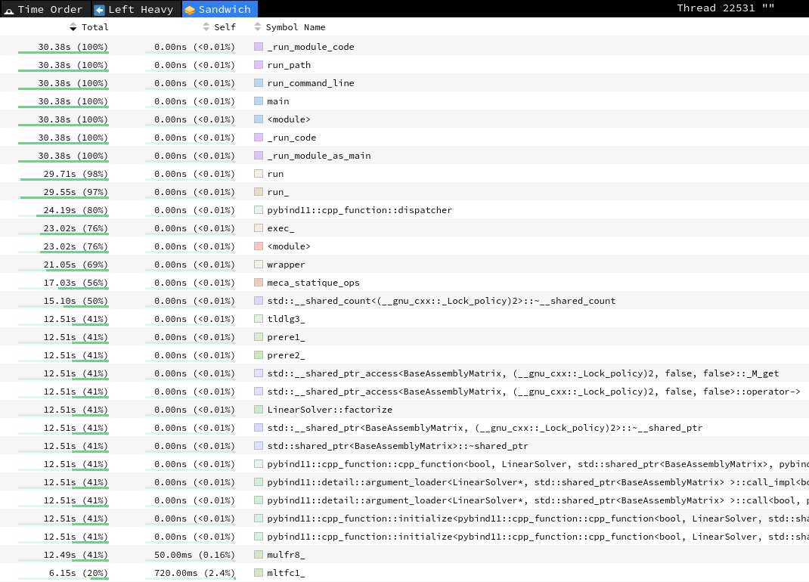

# Profiling with py-spy

This page presents a test of the profiling of a code_aster execution using
[py-spy](https://github.com/benfred/py-spy).
This tool merges the Python stack with the native C/C++/Fortran stacks.

This is a How-To, not a validation of the accuracy of this tool.

Summary

[[_TOC_]]

## Installation of py-spy

It can simply be installed with `pip`.
See the [py-spy](https://github.com/benfred/py-spy) repository for details.

```shell
pip install py-spy
```

## Adding py-spy as an _exectool_ for _run_aster_

`py-spy` is used as a prefix of the python command line.
So, it can easily be called as an _exectool_ for _run_aster_.

_exectools_ can be added in the user's configuration file
(see the [run_aster documentation](https://codeaster.readthedocs.io/en/latest/devguide/run_aster/run_aster.html#config-configuration-of-the-version) for details).

If you are using `~/.config/aster/config.yaml`:

```yaml
version:
- path: '*'
  config:
    exectool:
      py-spy: py-spy record --native --output=$HOME/data.${OMPI_COMM_WORLD_RANK:-0} --format=speedscope --
```

or if you are using `~/.config/aster/config.json`:

```json
{
    "version": [
        {
            "path": "*",
            "config": {
                "exectool": {
                    "py-spy": "py-spy record --native --output=$HOME/data.${OMPI_COMM_WORLD_RANK:-0} --format=speedscope --"
                }
            }
        }
    ]
}
```

In this example, the files generated by `py-spy` are written in `$HOME`
(change with prefered directory) and they are suffixed by the MPI rank.

Note:
> `config.yaml` is used if YAML is available in your Python installation.
> It can be easilly installed with `pip install pyyaml` (code_aster needs to be
> reconfigured).
> Calling `run_aster --debug` will show is the prolog the configuration files
> that are actually used.

## Example

With a standard installation of code_aster:

```shell
../install/mpi/bin/run_aster --exectool=py-spy path/to/file.export > output.log
```

Extract of the output file:

```none
[...]
# ------------------------------------------------------------------------------
Command line #1:
    ulimit -c unlimited ; ulimit -t 562 ; ( py-spy record --native --output=/local00/tmp/data.${OMPI_COMM_WORLD_RANK:-0} --format=speedscope -- /usr/bin/python3 -m mpi4py ./file.comm.changed.py ... --memory 4336.0 --tpmax 450 --numthreads 1 ; echo $? > _exit_code_ ) 2>&1 | tee -a fort.6
py-spy> Sampling process 100 times a second. Press Control-C to exit.

[...]
End of the Code_Aster execution
Code_Aster MPI exits normally
Exited

py-spy> Stopped sampling because process exited
py-spy> Wrote speedscope file to '.../data.0'. Samples: 3042 Errors: 0
py-spy> Visit https://www.speedscope.app/ to view
```

Visualize the results using the web-based viewer [speedscope](https://github.com/jlfwong/speedscope) by importing the generated profile file on
[https://www.speedscope.app/](https://www.speedscope.app/).


