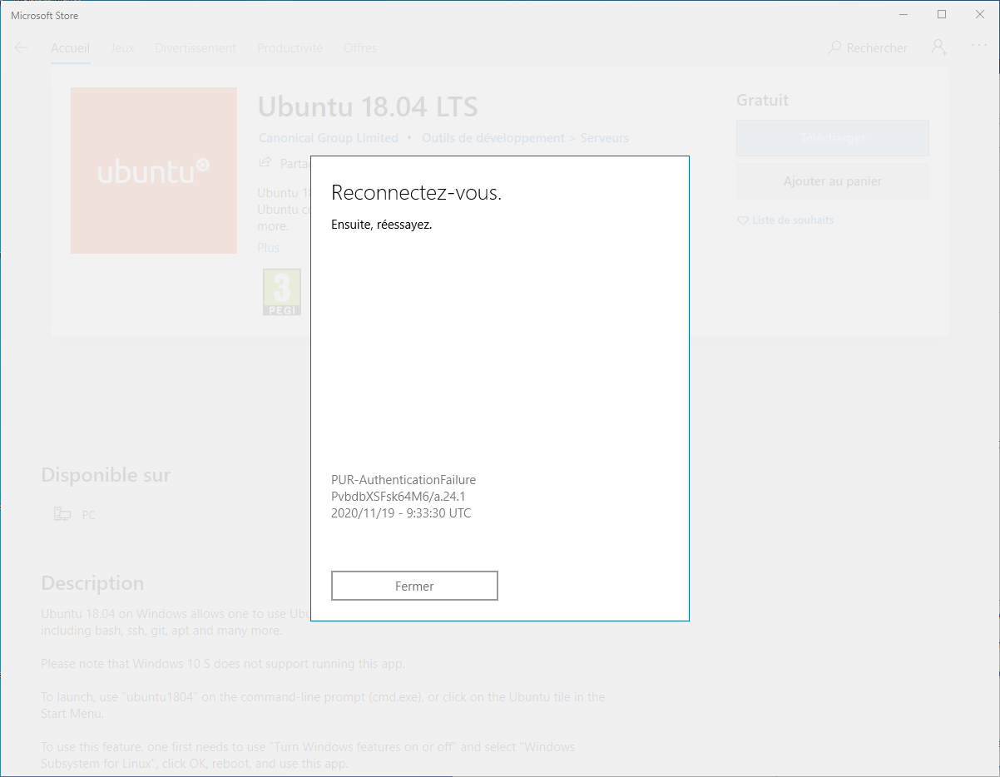
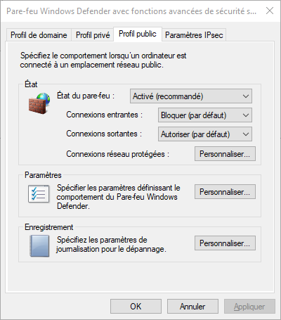
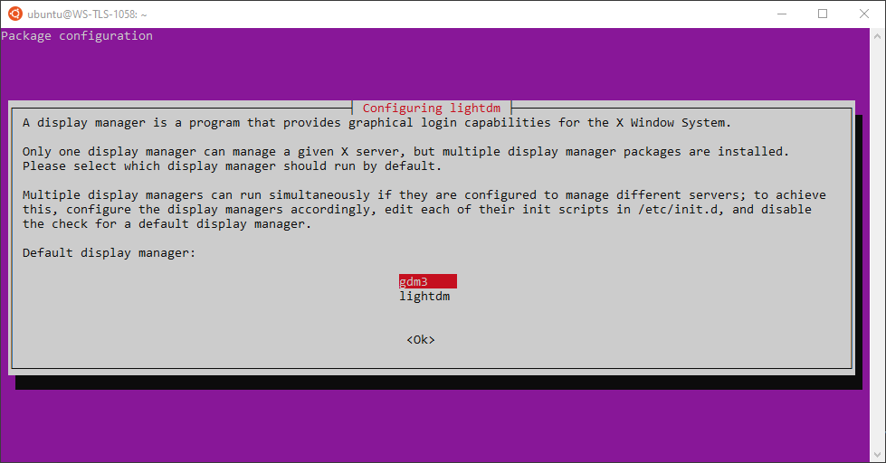
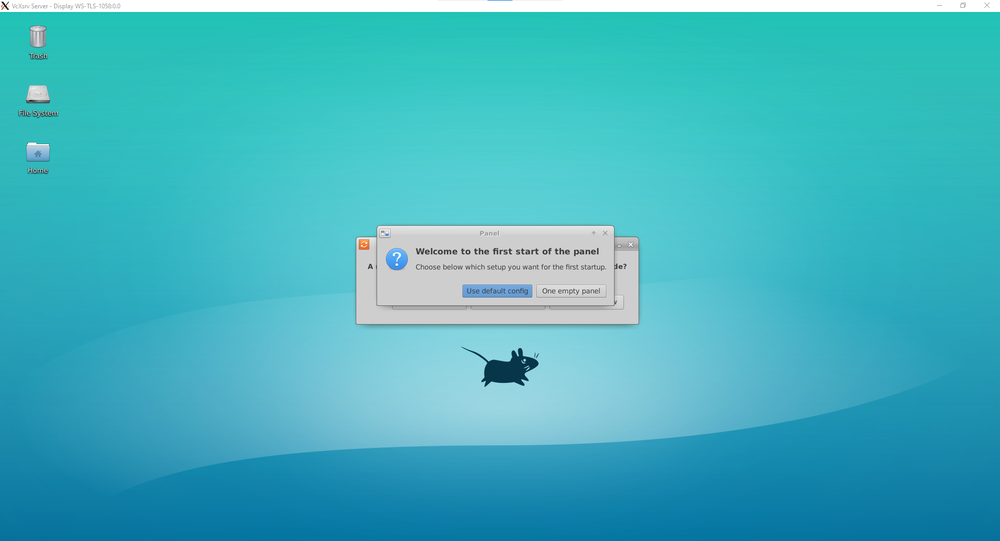

# Installation on Windows

> **NOTE:** This documentation is already outdated since WSL2 now seems to have its own Xserver!
> Would anyone be interested in updating it?
>
> Admin rights are required for the installation. However, they are not needed in
> order to use salome_meca once installed.

Summary

[[_TOC_]]

The installation process using Windows10 consists in :

- Installing WSL2 and a Linux OS within Windows10.

- Installation Singularity within WSL2's Linux OS.

Since WSL requires a Linux OS, Ubuntu-18.04 is here used as an example.

## Prerequisites

### WSL 2 Requirements

- In order to download an OS from Windows store, the status of the public profile
must allow outgoing connections (it is the default configuration).

- For x64 systems: Version 1903 or higher, with Build 18362 or higher.

- For ARM64 systems: Version 2004 or higher, with Build 19041 or higher.

- Builds lower than 18362 do not support WSL 2 but only WSL1, which is not compatible
with the provided container. Consequently, one must use the Windows Update Assistant
in order to update Windows' version.

To verify the version and the build number, on can run `winver`.

### Other requirements

- A X server server must be running on Windows 10 in order to access salome_meca's GUI.
Here, VcXsrv is employed but one can replace it with any other X server if configured correctly

- The SIF container file must be stored in this directory `C:\Users\Public\`.

## WSL2 installation

WSL refers to **Windows Subsystem for Linux**. It is a virtualised Linux OS operation
within Windows10. By default, WSL mounts the `C:\` drive on the Linux OS and consequently,
on can easily access the files on the Windows disk.

**Step 1.**: Enable the "Windows Subsystem for Linux" and "Virtual Machine Platform" optional features:

 For this step on must use Windows 10's **powershell**.

```powershell
Enable-WindowsOptionalFeature -Online -FeatureName Microsoft-Windows-Subsystem-Linux,VirtualMachinePlatform
```

**Step 2.**: Reboot the machine as required to complete the WSL installation and update to WSL 2.

**Step 3.**: Download the Linux kernel update package : WSL2 Linux kernel update package for x64 machines:
[Linux kernel update package](https://wslstorestorage.blob.core.windows.net/wslblob/wsl_update_x64.msi)

**Step 4.**: Install the aforementioned downloaded package

> The package will appear as "Windows Subsystem for Linux Update" in Windows applications list.

**Step 5.**: Set WSL 2 as your default version

```powershell
wsl --set-default-version 2
```

WSL2 allows the use of a full Linux kernel, which isn't possible when using WSL1.
Hence, the use of WSL2 is mandatory.

> **NOTE:** Once WSL is installed on the system, it can be used by all users. Yet, the configuration of the default version must be performed for evey user

If you happen to inadvertantly create a Virtual Machine running in WSL, follow these steps:

```powershell
wsl --terminate Ubuntu-18.04
wsl --set-version Ubuntu-18.04 2
wsl --distribution Ubuntu-18.04
```

> **NOTE:** Ubuntu-18.04 is the distribution used here. If you have installed already
> another distribution or want to use another one, replace Ubuntu-18.04 by the name
> of your distribution.

This process might take some time since the complete Linux OS is being dowloaded.

## Linux Installation within WSL

**Step 1.**: Install your Linux distribution of choice

Open the Microsoft Store and select one of the available Linux distributions.

The following links will open the Microsoft store page for each distribution:

- [Ubuntu 16.04 LTS ](https://www.microsoft.com/store/apps/9pjn388hp8c9)

- [Ubuntu 18.04 LTS ](https://www.microsoft.com/store/apps/9N9TNGVNDL3Q) (Version used here)

- [Ubuntu 20.04 LTS ](https://www.microsoft.com/store/apps/9n6svws3rx71)

- [openSUSE Leap 15.1 ](https://www.microsoft.com/store/apps/9NJFZK00FGKV)

- [SUSE Linux Enterprise Server 12 SP5 ](https://www.microsoft.com/store/apps/9MZ3D1TRP8T1)

- [SUSE Linux Enterprise Server 15 SP1 ](https://www.microsoft.com/store/apps/9PN498VPMF3Z)

- [Kali Linux ](https://www.microsoft.com/store/apps/9PKR34TNCV07)

- [Debian GNU/Linux ](https://www.microsoft.com/store/apps/9MSVKQC78PK6)

- [Fedora Remix for WSL ](https://www.microsoft.com/store/apps/9n6gdm4k2hnc)

- [Pengwin ](https://www.microsoft.com/store/apps/9NV1GV1PXZ6P)

- [Pengwin Enterprise ](https://www.microsoft.com/store/apps/9N8LP0X93VCP)

- [Alpine WSL ](https://www.microsoft.com/store/apps/9p804crf0395)

> **NOTE:** During the download of Linux distribution, an error may occur:
> **Error Windows Store PUR-AuthenticationFailure**. This error concerns "microsoft
> account sign-in assistant".



If it is the case, one must follow Step 1b. Otherwise, go directly to Step2

**Step 1b.**: Correcting MS sign-in assistant log in through Microsoft Account Identity Services. If this service is terminated, users will not be able to log on their computer using their Microsoft account.

To solve this issue, one can use the powershell in order to modify windows10's registry :

```powershell
REG ADD "HKEY_LOCAL_MACHINE\SOFTWARE\Microsoft\PolicyManager\current\device\Accounts" /v AllowMicrosoftAccountSignInAssistant /t REG_DWORD /d 1 /f
```

**Step 2.**: Set up a new distribution

Linux distributions are managed just like any other applications for Windows.
To run a distribution, wait for its download to be complete and then simply click on it
in the Start menu entry.

The first time you open a freshly installed Linux distribution, a console windows will
open and you'll be asked to wait for a few minutes. All future launches should take
less than a second.

> **NOTE:** Verify that the status of the public profile allows outgoing connections.



## Installing Linux Desktop and X server

### Preparing the Windows host

Install and run VcXsrv : https://sourceforge.net/projects/vcxsrv/

It consists in a X server running on Windows 10. One can use another Xserver if needed/ The Linux Distribution will then be able to communicate all the graphical user interfaces to this server.

> **NOTE:**
> VcXsrv must already be running when WSL is ran.
> Otherwise, Linux will not be able to communicate with the X server.

### Setting up the Desktop environment

**Step 1.**: Installing the desktop environment

Start by updating your system:

```bash
sudo apt update && sudo apt upgrade
```

**Step 2.**: Install the Xubuntu desktop:

```bash
apt install xubuntu-desktop
```

You'll be prompted to choose your Display Manager (DM) between GNOME Display Manager (GDM) and lightDM. Choose GNOME.



**Step 3.**: Defaut target should be "graphical.target".

```bash
systemctl get-default
```

If it's not, execute the following command:

```bash
sudo systemctl set-default graphical.target
```

**Step 4.**: To launch the Graphic interface, write int the WSL Linux prompt, after running VcXsrv:

```bash
startxfce4
```

Normally, you now have a Linux Desktop in VcXsrv's X-server. This desktop can be
used as any Linux system!



**Step 4. (optional)**: Configuring the desktop environment.

Normally, the DISPLAY environment variable within Linux is automatically updated.
If it was not the case, in order to launch X, you may have to manually assign the IP value
of the host machine to the DISPLAY variable. One may use such command in the Linux terminal:

```bash
export DISPLAY=$(cat /etc/resolv.conf | grep nameserver | awk '{print $2}'):0
```

## Install Singularity

This step is similar to the one in the Linux installation, but you probably have to compile it from scratch.

## Run the container

> **NOTE:** In order to user the container for the first time on a WSL session, the
> following command must be used. For some reasons, WSL forgets this configuration
> everytime the Linux machine is rebooted. Thus it needs to be done systematically
> in order to use salome_meca :

```bash
sudo rm -r /dev/shm
sudo mkdir /dev/shm
sudo chmod 777 /dev/shm
```

There must be another way to avoid this, but we did not have the time to look much further into it.

Running salome_meca is then very similar to running it in Linux.

> **NOTE:** GPU acceleration for Graphical purposes (i.e. not AI) is actually not
> supported by WSL2. As a consequence, one must use CPU acceleration using the
> MESA libraries. The `--soft` option must be employed in order a *crash*.
